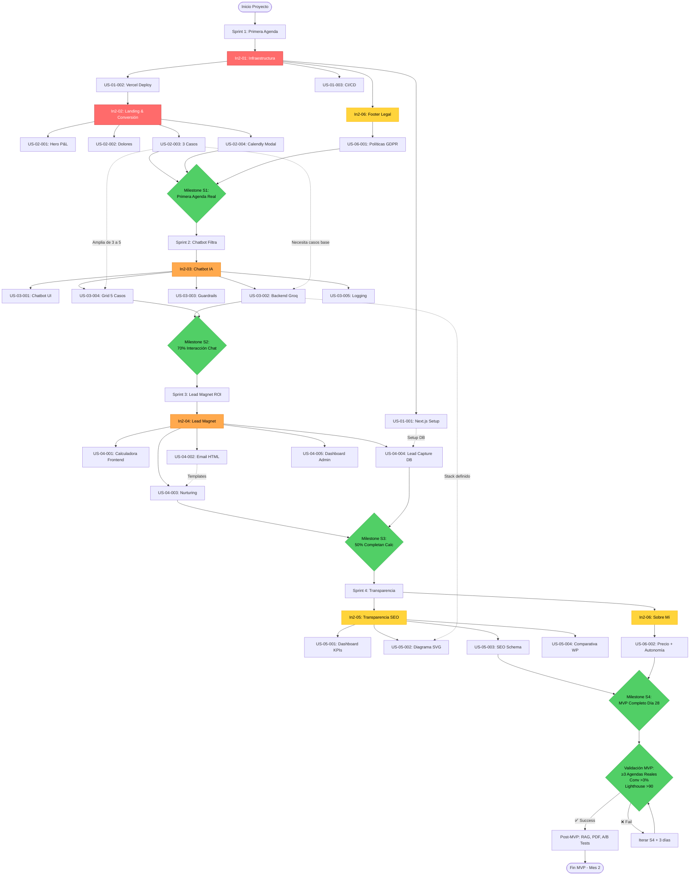

# PRODUCT BACKLOG v2.1 - Web Seller Machine "El Arquitecto que traduce P&L"

**Versión**: 2.1 Épicas + Dependencias (28 días)  
**Owner**: Francisco García Aparicio  
**Proyecto Linear**: `in2-web-personal`  
**Metodología**: Lean Startup + Vertical Slices 7 días + TDD estricto  
**Duración MVP**: 28 días laborables (4 sprints × 7 días)  
**North Star Metric**: 8-12 diagnósticos agendados/mes (mes 4-5)

---

## 📋 ÍNDICE

1. [Resumen Ejecutivo](#resumen-ejecutivo)
2. [Épicas del Proyecto](#épicas-del-proyecto)
3. [Mapa de Dependencias](#mapa-de-dependencias)
4. [Diagrama Flujo Proyecto (Mermaid)](#diagrama-flujo-proyecto)
5. [Historias Usuario por Épica](#historias-usuario-por-épica)
6. [Plan de Sprints](#plan-de-sprints)
7. [Criterios Validación MVP](#criterios-validación-mvp)

---

## 📊 RESUMEN EJECUTIVO

MVP de **28 días** que entrega web conversión B2B con 4 fuentes captación leads organizadas en **6 épicas temáticas**:

**Épicas MVP** (ordenadas por valor negocio):
- **In2-01**: Infraestructura & Deploy (base técnica)
- **In2-02**: Landing & Conversión Directa (hero + casos + Calendly)
- **In2-03**: Chatbot IA Cualificación (prompt engineering sin RAG)
- **In2-04**: Lead Magnet ROI (calculadora + email + nurturing)
- **In2-05**: Transparencia Técnica (dashboard + diagrama + SEO)
- **In2-06**: Contenido & Legal (políticas, sobre mí, precio)

**Recortes vs v1.0**: -51 SP, -12 días, -€20/mes, +15% simplicidad

---

## 🎯 ÉPICAS DEL PROYECTO

### In2-01: Infraestructura & Deploy Automático
**Objetivo**: Base técnica robusta con CI/CD automático  
**Prioridad**: 🔴 Urgent  
**Story Points Total**: 6 SP  
**Sprint**: 1  
**Valor Negocio**: Habilita todos los demás features, time-to-market crítico

**Issues incluidos**: 3
- US-01-001: Proyecto Next.js + TypeScript
- US-01-002: Vercel Deploy + DNS
- US-01-003: GitHub Actions CI/CD

**Labels**: `in2-web-personal`, `infra`

---

### In2-02: Landing & Conversión Directa
**Objetivo**: CEO agenda reunión en 2 clics tras entender propuesta P&L  
**Prioridad**: 🔴 Urgent  
**Story Points Total**: 13 SP  
**Sprint**: 1  
**Valor Negocio**: Primera impresión = 80% conversión posterior, crítico posicionamiento

**Issues incluidos**: 4
- US-02-001: Hero Section P&L
- US-02-002: Sección Dolores Cuantificados
- US-02-003: Grid 3 Casos Éxito Hardcoded
- US-02-004: Modal Calendly Flotante

**Labels**: `in2-web-personal`, `frontend`, `content`

**Dependencias**: Requiere US-01-002 (deploy funcionando)

---

### In2-03: Chatbot IA Cualificación Leads
**Objetivo**: 70% visitantes interactúan, chatbot filtra leads no cualificados  
**Prioridad**: 🟠 High  
**Story Points Total**: 17 SP  
**Sprint**: 2  
**Valor Negocio**: Automatiza cualificación, reduce llamadas no productivas 40%

**Issues incluidos**: 5
- US-03-001: Chatbot UI Flotante + Mobile
- US-03-002: Backend Groq + Prompt Engineering (SIN RAG)
- US-03-003: Guardrails Legales + Fallback
- US-03-004: Grid 5 Casos Completo
- US-03-005: Logging Conversaciones Básico

**Labels**: `in2-web-personal`, `frontend`, `backend`

**Dependencias**: Requiere US-02-003 (casos base para contexto), US-01-002 (deploy)

---

### In2-04: Lead Magnet ROI Auto-Servicio
**Objetivo**: Leads fríos calculan ROI, entran nurturing automático  
**Prioridad**: 🟠 High  
**Story Points Total**: 15 SP  
**Sprint**: 3  
**Valor Negocio**: Captura emails cualificados sin intervención manual

**Issues incluidos**: 5
- US-04-001: Calculadora ROI Frontend
- US-04-002: Email HTML Resultados (SIN PDF)
- US-04-003: Secuencia Nurturing 2 Emails
- US-04-004: Lead Capture Postgres
- US-04-005: Dashboard Admin Leads Light

**Labels**: `in2-web-personal`, `frontend`, `backend`

**Dependencias**: Requiere US-01-002 (deploy), US-01-001 (DB setup)

---

### In2-05: Transparencia Técnica & SEO
**Objetivo**: Web demuestra expertise, cierra clientes técnicos/CFOs  
**Prioridad**: 🟡 Medium  
**Story Points Total**: 13 SP  
**Sprint**: 4  
**Valor Negocio**: Diferenciación competitiva, credibilidad técnica

**Issues incluidos**: 4
- US-05-001: Página /transparencia + Dashboard KPIs Manual
- US-05-002: Diagrama Arquitectura SVG Estático
- US-05-003: SEO Avanzado (Schema.org + Sitemap XML)
- US-05-004: Comparativa Stack vs WordPress

**Labels**: `in2-web-personal`, `frontend`, `content`

**Dependencias**: Requiere US-01-002 (deploy), US-03-002 (stack definido para documentar)

---

### In2-06: Contenido Legal & Presentación
**Objetivo**: Cumplimiento legal GDPR + cierre objeciones precio/autonomía  
**Prioridad**: 🟡 Medium  
**Story Points Total**: 3 SP  
**Sprint**: 1, 4  
**Valor Negocio**: Compliance obligatorio + cierra objeciones finales

**Issues incluidos**: 2
- US-06-001: Footer + Políticas Legales Básicas
- US-06-002: Sobre Mí + Precio + Autonomía

**Labels**: `in2-web-personal`, `content`

**Dependencias**: US-06-001 no tiene, US-06-002 requiere US-02-001 (estructura página)

---

## 🔗 MAPA DE DEPENDENCIAS

### Dependencias Críticas (Bloqueantes)

```
US-01-002 (Vercel Deploy) BLOQUEA:
  ├─ US-02-001 (Hero)
  ├─ US-02-004 (Calendly)
  ├─ US-03-001 (Chatbot UI)
  ├─ US-04-001 (Calculadora)
  └─ US-05-001 (Transparencia)

US-02-003 (3 Casos Base) BLOQUEA:
  ├─ US-03-002 (Backend Chat - necesita casos para contexto)
  └─ US-03-004 (Grid 5 casos - ampliación)

US-01-001 (Setup Next.js + DB) BLOQUEA:
  ├─ US-04-004 (Lead Capture Postgres)
  └─ US-03-005 (Logging Postgres)

US-03-002 (Stack Backend definido) BLOQUEA:
  └─ US-05-002 (Diagrama Arquitectura - necesita stack completo)
```

### Dependencias Recomendadas (No bloqueantes)

```
US-02-001 (Hero estructura) RECOMIENDA ANTES:
  └─ US-06-002 (Sobre Mí - reusa estructura página)

US-04-002 (Email HTML) RECOMIENDA ANTES:
  └─ US-04-003 (Nurturing - reusa templates email)
```

---

## 📊 DIAGRAMA FLUJO PROYECTO



---

## 📝 HISTORIAS USUARIO POR ÉPICA

### 🔴 In2-01: Infraestructura & Deploy

---

## US-01-001: Setup Proyecto Next.js 15 + TypeScript + Postgres

**Épica**: In2-01  
**Prioridad**: 🔴 Urgent  
**Story Points**: 2 SP  
**Sprint**: 1  
**Labels**: `in2-web-personal`, `infra`  
**Bloqueadores**: Ninguno  
**Bloquea a**: US-04-004, US-03-005

**Como** desarrollador  
**Quiero** proyecto Next.js configurado con TypeScript strict  
**Para** garantizar type-safety y base código mantenible

### Criterios de Aceptación (Gherkin)

```gherkin
Feature: Setup proyecto base
  Como desarrollador iniciando MVP
  Quiero entorno Next.js completo
  Para comenzar desarrollo features

  Scenario: Proyecto inicializado
    Given ejecuto npm create next-app@latest
    When configuro TypeScript strict mode
    And instalo Tailwind CSS + Shadcn/ui
    And configuro Vercel Postgres
    Then proyecto compila sin errores
    And npm run dev funciona puerto 3000
    And TypeScript strict pasa
```

### Estrategia de Tests

```typescript
// tests/setup.test.ts
describe('Project Setup', () => {
  it('TypeScript compila sin errores', async () => {
    const result = await exec('npx tsc --noEmit');
    expect(result.stderr).toBe('');
  });
  
  it('Vercel Postgres conecta', async () => {
    const { sql } = await import('@vercel/postgres');
    const result = await sql`SELECT 1 as test`;
    expect(result.rows[0].test).toBe(1);
  });
});
```

### Definición de Hecho

```gherkin
Given US-01-001 completa
Then:
  # Funcional
  * Next.js 15 App Router instalado
  * TypeScript strict mode: true
  * Tailwind CSS configurado
  * Shadcn/ui init completado
  * Vercel Postgres @vercel/postgres instalado
  * Variables entorno .env.local template
  
  # Técnico
  * npm run dev funciona
  * npm run build completa sin errores
  * npm run lint pasa (ESLint strict)
  * tsconfig.json con strict: true
  
  # Documentación
  * README.md con instrucciones setup
  * .env.example con variables requeridas
```

---

## US-01-002: Vercel Deploy + DNS fjgaparicio.es

**Épica**: In2-01  
**Prioridad**: 🔴 Urgent  
**Story Points**: 2 SP  
**Sprint**: 1  
**Labels**: `in2-web-personal`, `infra`  
**Bloqueadores**: US-01-001  
**Bloquea a**: US-02-001, US-02-004, US-03-001, US-04-001, US-05-001

**Como** owner  
**Quiero** web accesible públicamente con dominio propio  
**Para** validar MVP con clientes reales

### Criterios de Aceptación (Gherkin)

```gherkin
Feature: Deploy automático producción
  Como owner validando MVP
  Quiero URL pública HTTPS
  Para compartir con primeros CEOs

  Scenario: Deploy producción
    Given proyecto conectado Vercel
    When push a rama main
    Then deploy automático <2 min
    And https://fjgaparicio.es accesible
    And SSL certificado activo
    And redirect www → apex domain
```

### Definición de Hecho

```gherkin
Given US-01-002 completa
Then:
  * Proyecto Vercel creado
  * GitHub repo conectado
  * Rama main → producción automática
  * Dominio fjgaparicio.es configurado
  * DNS apuntando Vercel
  * Certificado SSL automático Let's Encrypt
  * Variables entorno producción configuradas
  * Smoke test: curl https://fjgaparicio.es (200 OK)
```

---

## US-01-003: GitHub Actions CI/CD (Lint + Type-Check + Build)

**Épica**: In2-01  
**Prioridad**: 🔴 Urgent  
**Story Points**: 2 SP  
**Sprint**: 1  
**Labels**: `in2-web-personal`, `infra`  
**Bloqueadores**: US-01-001  
**Bloquea a**: Ninguno (calidad código)

**Como** desarrollador  
**Quiero** CI automático cada PR  
**Para** evitar romper producción

### Criterios de Aceptación (Gherkin)

```gherkin
Feature: CI automático
  Como desarrollador en equipo 1
  Quiero tests automáticos cada push
  Para garantizar calidad

  Scenario: PR trigger CI
    Given creo PR a main
    When GitHub Actions ejecuta
    Then lint pasa
    And type-check pasa
    And build completa
    And PR solo merge si CI verde
```

### GitHub Actions Workflow

```yaml
# .github/workflows/ci.yml
name: CI
on:
  pull_request:
  push:
    branches: [main]

jobs:
  test:
    runs-on: ubuntu-latest
    steps:
      - uses: actions/checkout@v4
      - uses: actions/setup-node@v4
        with:
          node-version: 20
          cache: 'npm'
      
      - run: npm ci
      - run: npm run lint
      - run: npm run type-check
      - run: npm run build
```

### Definición de Hecho

```gherkin
Given US-01-003 completa
Then:
  * Workflow .github/workflows/ci.yml
  * Ejecuta en PR + push main
  * Steps: lint, type-check, build
  * Badge CI en README.md
  * Protección rama: require status checks
```

---

### 🔴 In2-02: Landing & Conversión Directa

---

## US-02-001: Hero Section P&L Impacto Inmediato

**Épica**: In2-02  
**Prioridad**: 🔴 Urgent  
**Story Points**: 5 SP  
**Sprint**: 1  
**Labels**: `in2-web-personal`, `frontend`, `content`  
**Bloqueadores**: US-01-002  
**Bloquea a**: US-06-002 (recomienda estructura)

**Como** CEO que llega por referencia  
**Quiero** entender en <10s qué haces y para quién  
**Para** decidir si seguir leyendo

### Descripción Impacto Negocio

Hero = **primera impresión = 80% conversión posterior**. Mal diseñado → bounce >70%. Orientado P&L con números concretos (payback <6 meses, empresas 5-50M€) → cualificación inmediata. **Impacto directo criterios "Posicionamiento P&L" (18%) + "Conversión" (22%)**.

### Criterios de Aceptación (Gherkin)

```gherkin
Feature: Hero impacto inmediato P&L
  Como CEO con poco tiempo
  Quiero ver propuesta valor cuantificada
  Para decidir en 10 segundos

  Scenario: Visitante nuevo accede home
    Given soy CEO entrando a https://fjgaparicio.es
    When página carga
    Then veo headline "Reduzco tu factura Cloud y automatizo procesos con payback <6 meses"
    And veo subtítulo "Para empresas industriales, logísticas y agencias 5–50M€"
    And veo foto profesional badge "+37 años gestionando P&L"
    And veo CTA flotante "Diagnóstico gratuito 30 min" visible sin scroll
    And LCP <2s mobile 4G

  Scenario: CEO hace clic CTA
    Given estoy en hero
    When clic "Diagnóstico gratuito 30 min"
    Then modal Calendly abre <500ms
    And NO redirige otra página
    And puedo cerrar modal [X], [ESC], clic fuera
```

### Estrategia de Tests (TDD Obligatorio - P0)

**ANTES de escribir código funcional**:

```typescript
// tests/e2e/hero.spec.ts
import { test, expect } from '@playwright/test';

test('US-02-001: Hero visible y LCP <2s', async ({ page }) => {
  await page.goto('/');
  
  // Headline visible
  const headline = page.locator('h1');
  await expect(headline).toContainText('Reduzco tu factura Cloud');
  
  // Subtítulo segmento
  const subtitle = page.locator('h2');
  await expect(subtitle).toContainText('5–50M€');
  
  // CTA flotante
  const cta = page.locator('[data-testid="cta-calendly"]');
  await expect(cta).toBeVisible();
  
  // LCP <2s
  const metrics = await page.evaluate(() => {
    return new Promise((resolve) => {
      new PerformanceObserver((list) => {
        const entries = list.getEntries();
        const lcp = entries[entries.length - 1];
        resolve(lcp.renderTime || lcp.loadTime);
      }).observe({ entryTypes: ['largest-contentful-paint'] });
      
      setTimeout(() => resolve(0), 3000);
    });
  });
  
  expect(metrics).toBeLessThan(2000);
});
```

### Definición de Hecho

```gherkin
Given US-02-001 completa
Then:
  # Funcional
  * Hero visible above fold (sin scroll) mobile+desktop
  * CTA flotante position: fixed bottom-right desktop / bottom-center mobile
  * Modal Calendly abre <500ms
  
  # Técnico
  * Código app/page.tsx
  * Componente <Hero> reutilizable components/Hero.tsx
  * Tests E2E hero.spec.ts PASANDO
  * Tests unitarios hero.test.tsx PASANDO
  
  # Performance
  * Lighthouse Performance >85 mobile
  * LCP <2s mobile 4G
  * Imagen hero WebP <80KB, priority loading
  
  # Contenido
  * Copy aprobado Fran (validado 2 CEOs conocidos)
  * Badge "+37 años" visible
  * Headline usa verbos acción ("Reduzco", NO "Ayudo a")
  
  # Deploy
  * Desplegado Vercel producción
  * https://fjgaparicio.es accesible
```

---

## US-02-002: Sección "¿Te pasa esto?" Dolores Cuantificados

**Épica**: In2-02  
**Prioridad**: 🔴 Urgent  
**Story Points**: 2 SP  
**Sprint**: 1  
**Labels**: `in2-web-personal`, `frontend`, `content`  
**Bloqueadores**: US-01-002  
**Bloquea a**: Ninguno

**Como** gerente con problemas operativos  
**Quiero** ver reflejados mis dolores con números  
**Para** sentir que entiendes mi situación

### Descripción Impacto Negocio

Identificación emocional visitante. Dolor cuantificado ("2-4h/día picando facturas" vs "procesos manuales lentos") → CEO se reconoce y sigue leyendo. **Impacto "Conversión" (22%) vía reducción bounce rate + aumento scroll depth**.

### Criterios de Aceptación (Gherkin)

```gherkin
Feature: Identificación dolores cuantificados
  Como gerente con problemas específicos
  Quiero ver dolores con números concretos
  Para reconocer mi situación

  Scenario: Lectura dolores
    Given estoy en home tras hero
    When scroll a "¿Te pasa esto?"
    Then veo exactamente 3 bullets:
      | Dolor | Cuantificación |
      | Procesos manuales | 2-4 h/día picando facturas/albaranes |
      | Factura cloud | AWS/Azure subió >30% sin explicación |
      | Forecasting | Previsiones Excel fallan 20-30% |
    And cada bullet icono ❌
    And texto lenguaje P&L (no técnico)
```

### Estrategia de Tests (TDD - P0)

```typescript
// tests/e2e/pain-points.spec.ts
test('US-02-002: 3 dolores visibles', async ({ page }) => {
  await page.goto('/');
  await page.locator('text=¿Te pasa esto?').scrollIntoViewIfNeeded();
  
  const dolores = page.locator('[data-testid="dolor-item"]');
  await expect(dolores).toHaveCount(3);
  await expect(dolores.first()).toContainText('2-4 h/día');
});
```

### Definición de Hecho

```gherkin
Given US-02-002 completa
Then:
  * Sección visible tras hero
  * 3 bullets hardcoded (no CMS S1)
  * Componente <PainPoints>
  * Test pain-points.spec.ts PASANDO
  * Fondo gris #F9FAFB contraste
  * Mobile sin scroll horizontal
```

---

## US-02-003: Grid 3 Casos Éxito con ROI Específico

**Épica**: In2-02  
**Prioridad**: 🔴 Urgent  
**Story Points**: 3 SP  
**Sprint**: 1  
**Labels**: `in2-web-personal`, `frontend`, `content`  
**Bloqueadores**: US-01-002  
**Bloquea a**: US-03-002, US-03-004 (casos base para chat)

**Como** CEO escéptico  
**Quiero** ver 3 casos reales con ROI específico  
**Para** creer que funciona en empresas como mía

### Descripción Impacto Negocio

Prueba social crítica. Casos sin ROI = portfolio técnico (no convierte). Casos con "Inversión 4.8K€ → Ahorro 38K€/año → Payback 6 semanas" = negocio tangible. **Impacto directo "Demostración casos" (15%) + "Conversión" (22%)**.

### Criterios de Aceptación (Gherkin)

```gherkin
Feature: Casos P&L como prueba social
  Como CEO necesitando evidencia
  Quiero casos reales con números
  Para validar experiencia

  Scenario: Visualización 3 casos
    Given estoy en home
    When scroll a "Casos de Éxito"
    Then veo 3 tarjetas cada una:
      | Campo | Ejemplo |
      | Sector + Tamaño | Logística · 8M€ · 45 empleados |
      | Dolor | 42.000€/año picando albaranes |
      | Solución | OCR + integración ERP |
      | ROI | Inversión 4.8K€ → Ahorro 38K€ → Payback 6 semanas |
    And cada tarjeta CTA "¿Tu caso se parece?"
    And CTA abre Calendly con UTM source=caso-logistica
```

### Datos Hardcoded

```typescript
// data/cases.ts
export const CASOS_MVP = [
  {
    id: 'caso-001',
    sector: 'Logística',
    company_size: '8M€',
    employees: 45,
    pain: '42.000€/año picando albaranes en papel',
    solution: 'OCR + flujo automático a ERP',
    investment: 4800,
    savings_annual: 38000,
    payback_weeks: 6,
  },
  {
    id: 'caso-002',
    sector: 'Agencia Marketing',
    company_size: '12M€',
    employees: 60,
    pain: 'Factura AWS 8.5K€/mes sin control',
    solution: 'Rightsizing + Reserved Instances',
    investment: 3200,
    savings_annual: 35000,
    payback_weeks: 4,
  },
  {
    id: 'caso-003',
    sector: 'Fabricante Industrial',
    company_size: '25M€',
    employees: 120,
    pain: 'Forecasting demanda falla 30%',
    solution: 'ML predicción + alertas automáticas',
    investment: 9500,
    savings_annual: 85000,
    payback_weeks: 5,
  },
];
```

### Estrategia de Tests (TDD - P0)

```typescript
test('US-02-003: 3 casos con ROI', async ({ page }) => {
  await page.goto('/');
  const casos = page.locator('[data-testid="case-card"]');
  await expect(casos).toHaveCount(3);
  
  const primerCaso = casos.first();
  await expect(primerCaso).toContainText('Logística');
  await expect(primerCaso).toContainText('42.000€/año');
  await expect(primerCaso).toContainText('Payback');
});
```

### Definición de Hecho

```gherkin
Given US-02-003 completa
Then:
  * 3 casos data/cases.ts
  * Componente <CaseGrid>
  * Cada caso validado CEO real (email/contrato)
  * Test case-grid.spec.ts PASANDO
  * CTA Calendly con UTM tracking
  * Responsive: 1 col mobile, 3 cols desktop
```

---

## US-02-004: Modal Calendly Flotante 2 Clics

**Épica**: In2-02  
**Prioridad**: 🔴 Urgent  
**Story Points**: 3 SP  
**Sprint**: 1  
**Labels**: `in2-web-personal`, `frontend`  
**Bloqueadores**: US-01-002  
**Bloquea a**: Ninguno

**Como** CEO interesado  
**Quiero** agendar en 2 clics sin formularios largos  
**Para** no abandonar por fricción

### Descripción Impacto Negocio

Conversión directa. Cada clic extra = -20% conversión. Modal Calendly directo vs formulario contacto = **3x más conversión**. **Impacto crítico "Conversión" (22%)**.

### Criterios de Aceptación (Gherkin)

```gherkin
Feature: Agendamiento sin fricción
  Como CEO con agenda apretada
  Quiero agendar en 2 clics exactos
  Para no perder tiempo

  Scenario: Apertura modal CTA
    Given estoy en cualquier parte home
    When clic CTA flotante "Diagnóstico 30 min"
    Then modal Calendly abre centrado
    And overlay oscuro semitransparente
    And scroll página bloqueado
    And cierro con [X], [ESC], clic fuera

  Scenario: Agendamiento completo
    Given modal Calendly abierto
    When selecciono slot "15 Enero 10:00"
    And relleno nombre "Juan Pérez"
    And relleno email "juan@empresa.com"
    And respondo "¿Qué optimizar?" → "Reducir factura AWS"
    And confirmo
    Then veo confirmación Calendly
    And recibo email <1 min
    And evento analytics "calendly_booking_completed"
```

### Estrategia de Tests (TDD - P0)

```typescript
test('US-02-004: Modal Calendly funcional', async ({ page }) => {
  await page.goto('/');
  await page.click('[data-testid="cta-calendly"]');
  
  const modal = page.locator('[data-testid="calendly-modal"]');
  await expect(modal).toBeVisible();
  
  // Iframe Calendly
  const iframe = modal.locator('iframe');
  await expect(iframe).toHaveAttribute('src', /calendly\.com/);
  
  // Cerrar ESC
  await page.keyboard.press('Escape');
  await expect(modal).not.toBeVisible();
});
```

### Definición de Hecho

```gherkin
Given US-02-004 completa
Then:
  * Librería react-calendly instalada
  * Componente <CalendlyModal>
  * Modal Radix UI Dialog (a11y)
  * CTA flotante: desktop top-right sticky, mobile bottom-center
  * Test calendly-modal.spec.ts PASANDO
  * Analytics tracking (opened, completed)
  * Cuenta Calendly con evento activo
```

---

### 🟠 In2-03: Chatbot IA Cualificación

---

## US-03-001: Chatbot UI Flotante + Mobile UX

**Épica**: In2-03  
**Prioridad**: 🟠 High  
**Story Points**: 5 SP  
**Sprint**: 2  
**Labels**: `in2-web-personal`, `frontend`  
**Bloqueadores**: US-01-002  
**Bloquea a**: US-03-002 (backend necesita UI)

**Como** visitante curioso  
**Quiero** hacer preguntas sin compromiso  
**Para** entender si Fran puede ayudarme

### Criterios de Aceptación (Gherkin)

```gherkin
Feature: Chatbot accesible no invasivo
  Como visitante prefiriendo chatear
  Quiero botón chat siempre visible
  Para preguntar sin comprometerme

  Scenario: Apertura chatbot
    Given estoy en home
    When veo botón flotante "¿Dudas? Pregúntame"
    And clic
    Then panel chat abre (300px desktop, fullscreen mobile)
    And mensaje bienvenida visible
    And campo texto escribir visible
    
  Scenario: Envío mensaje
    Given chat abierto
    When escribo "Hola"
    And Enter
    Then veo mi mensaje en historial
    And indicador "escribiendo..."
    And respuesta aparece <5s
```

### Estrategia de Tests (TDD - P0)

```typescript
test('US-03-001: Chatbot UI funcional', async ({ page }) => {
  await page.goto('/');
  await page.click('[data-testid="chat-button"]');
  
  const chatPanel = page.locator('[data-testid="chat-panel"]');
  await expect(chatPanel).toBeVisible();
  
  await page.fill('[data-testid="chat-input"]', 'Test mensaje');
  await page.press('[data-testid="chat-input"]', 'Enter');
  
  await expect(page.locator('text=Test mensaje')).toBeVisible();
});
```

### Definición de Hecho

```gherkin
Given US-03-001 completa
Then:
  * Botón flotante bottom-right
  * Panel slide-in 300ms
  * Historial persiste localStorage (máx 20)
  * Componente <ChatWidget>
  * Test chatbot-ui.spec.ts PASANDO
  * Mobile: fullscreen, teclado no rompe layout
```

---

## US-03-002: Backend Chat Groq + Prompt Engineering SIN RAG

**Épica**: In2-03  
**Prioridad**: 🟠 High  
**Story Points**: 8 SP  
**Sprint**: 2  
**Labels**: `in2-web-personal`, `backend`  
**Bloqueadores**: US-03-001, US-02-003 (casos contexto)  
**Bloquea a**: US-05-002 (stack definido para diagrama)

**Como** visitante preguntando  
**Quiero** respuestas inteligentes basadas casos reales  
**Para** info específica sin hablar ventas

### Descripción Impacto Negocio

**DECISIÓN CRÍTICA ANTI-CAMELLO**: Prompt engineering con casos hardcoded en system prompt vs RAG completo (Pinecone + embeddings = 13 SP). Llama 3.3 ventana contexto 128K tokens = suficiente 10 casos.

**Ventajas**: -8 SP complejidad, €0 infra vectorial, -2h/mes mantenimiento.

**Trade-off aceptado**: Si casos >50, necesitaremos RAG (Post-MVP).

### Criterios de Aceptación (Gherkin)

```gherkin
Feature: Respuestas IA con casos contexto
  Como visitante preguntando
  Quiero respuestas basadas casos reales
  Para info concreta

  Scenario: Pregunta factura cloud
    Given chat abierto
    When escribo "¿Experiencia reduciendo AWS?"
    Then sistema:
      1. Envía POST /api/chat
      2. Backend construye prompt con casos
      3. Groq responde <3s
      4. Veo respuesta mencionando 2 casos específicos
      5. Termina "¿Quieres revisar tu caso? [Agendar]"
```

### System Prompt

```typescript
// prompts/chatbot-system.ts
export const SYSTEM_PROMPT = `
Eres asistente Francisco García, arquitecto 37 años experiencia cloud & AI.

TRABAJO:
- Responder sobre experiencia Francisco
- Mencionar casos reales específicos con números
- Tono: profesional cercano, lenguaje P&L (no técnico)
- Tras 2-3 mensajes → sugerir agendar diagnóstico

CASOS QUE CONOCES:
${JSON.stringify(CASOS_PARA_CONTEXTO, null, 2)}

GUARDRAILS LEGALES OBLIGATORIOS:
- Cifras ROI son estimaciones orientativas
- Diagnóstico real en llamada 30 min gratuita
- NUNCA garantizar resultados sin diagnóstico previo
- Si preguntan precio: "Entre 4-25K€ según alcance, hablamos en diagnóstico"

FORMATO RESPUESTAS:
- Máximo 3 párrafos cortos
- Incluir 1-2 casos concretos con números
- Terminar con CTA suave agendar
`;
```

### Estrategia de Tests (TDD - P0)

```typescript
// tests/api/chat.test.ts
describe('POST /api/chat', () => {
  it('responde con casos en contexto', async () => {
    const response = await fetch('/api/chat', {
      method: 'POST',
      body: JSON.stringify({
        message: '¿Experiencia AWS?',
        history: []
      })
    });
    
    const data = await response.json();
    expect(data.reply).toContain('logística');
    expect(data.reply).toContain('35%');
  });
  
  it('timeout fallback <8s', async () => {
    jest.setTimeout(10000);
    const response = await fetch('/api/chat', {
      method: 'POST',
      body: JSON.stringify({ message: 'test' })
    });
    
    expect(response.status).toBe(200);
  });
});
```

### Definición de Hecho

```gherkin
Given US-03-002 completa
Then:
  * API POST /api/chat
  * Groq integrado (llama-3.3-70b-versatile)
  * System prompt prompts/chatbot-system.ts
  * 5-10 casos en contexto desde data/cases.ts
  * Fallback timeout >8s mensaje genérico
  * Rate limiting 10 msg/IP/hora (Vercel KV)
  * Logging básico Postgres
  * Test chat.test.ts PASANDO
  * Coste <€5/mes
```

---

## US-03-003: Guardrails Legales + Fallback Errores

**Épica**: In2-03  
**Prioridad**: 🟠 High  
**Story Points**: 2 SP  
**Sprint**: 2  
**Labels**: `in2-web-personal`, `backend`  
**Bloqueadores**: US-03-002  
**Bloquea a**: Ninguno

**Como** Francisco  
**Quiero** chatbot NUNCA prometa resultados garantizados  
**Para** evitar problemas legales

### Criterios de Aceptación (Gherkin)

```gherkin
Feature: Protección legal chatbot
  Como owner responsabilidad legal
  Quiero disclaimers claros
  Para evitar promesas incumplibles

  Scenario: Disclaimer visible
    Given abro chatbot
    Then veo footer sticky:
      "Estimaciones orientativas. Diagnóstico real en 30 min."
      
  Scenario: Error Groq timeout
    Given Groq tarda >8s
    When timeout dispara
    Then veo mensaje fallback:
      "Disculpa, el sistema está saturado. ¿Agendamos 30 min para hablar?"
```

### Definición de Hecho

```gherkin
Given US-03-003 completa
Then:
  * Disclaimer sticky footer chat
  * System prompt incluye GUARDRAILS LEGALES
  * Fallback errores implementado
  * Test guardrails.test.ts PASANDO
```

---

## US-03-004: Grid 5 Casos Completo (Ampliación desde 3)

**Épica**: In2-03  
**Prioridad**: 🟠 High  
**Story Points**: 2 SP  
**Sprint**: 2  
**Labels**: `in2-web-personal`, `frontend`, `content`  
**Bloqueadores**: US-02-003  
**Bloquea a**: Ninguno

**Como** CEO buscando caso similar  
**Quiero** ver más variedad sectores  
**Para** encontrar caso parecido al mío

### Criterios de Aceptación (Gherkin)

```gherkin
Feature: Ampliar casos prueba social
  Como CEO comparando
  Quiero 5 casos mínimo
  Para mayor probabilidad match

  Scenario: 5 casos visibles
    Given estoy en home
    When scroll a "Casos de Éxito"
    Then veo 5 tarjetas
    And mínimo 4 sectores diferentes
```

### Definición de Hecho

```gherkin
Given US-03-004 completa
Then:
  * 5 casos en data/cases.ts
  * Mínimo 4 sectores diferentes
  * Tests actualizados expect(casos).toHaveCount(5)
  * Grid responsive: 1 col mobile, 2-3 cols desktop
```

---

## US-03-005: Logging Conversaciones Postgres Básico

**Épica**: In2-03  
**Prioridad**: 🟡 Medium  
**Story Points**: 2 SP  
**Sprint**: 2  
**Labels**: `in2-web-personal`, `backend`  
**Bloqueadores**: US-01-001, US-03-002  
**Bloquea a**: Ninguno

### Schema Postgres

```sql
CREATE TABLE chatbot_logs (
  id UUID PRIMARY KEY DEFAULT gen_random_uuid(),
  session_id TEXT NOT NULL,
  message_user TEXT,
  message_assistant TEXT,
  model TEXT DEFAULT 'llama-3.3-70b',
  tokens_used INT,
  response_time_ms INT,
  created_at TIMESTAMP DEFAULT NOW()
);

CREATE INDEX idx_session ON chatbot_logs(session_id);
CREATE INDEX idx_created ON chatbot_logs(created_at DESC);
```

### Definición de Hecho

```gherkin
Given US-03-005 completa
Then:
  * Tabla chatbot_logs creada
  * /admin/chat-logs con Basic Auth
  * Vista últimas 20 conversaciones
  * Filtro por fecha
```

---

### 🟠 In2-04: Lead Magnet ROI

---

## US-04-001: Calculadora ROI Frontend Interactiva

**Épica**: In2-04  
**Prioridad**: 🟠 High  
**Story Points**: 5 SP  
**Sprint**: 3  
**Labels**: `in2-web-personal`, `frontend`  
**Bloqueadores**: US-01-002  
**Bloquea a**: US-04-002 (datos calculadora)

**Como** gerente justificando presupuesto  
**Quiero** calcular ahorro potencial  
**Para** presentar business case

### Criterios de Aceptación (Gherkin)

```gherkin
Feature: Calculadora ROI auto-servicio
  Como gerente justificando inversión
  Quiero cálculo instantáneo
  Para business case

  Scenario: Cálculo completo
    Given estoy en /calculadora-roi
    When relleno:
      | Campo | Valor |
      | Documentos/mes | 500 |
      | Minutos/documento | 12 |
      | Coste/hora empleado | 25€ |
      | Margen error | 30% |
    And clic "Calcular"
    Then veo resultados <500ms:
      | Métrica | Valor |
      | Coste actual anual | 30.000€ |
      | Ahorro potencial 70% | 21.000€ |
      | Inversión estimada | 8.500€ |
      | Payback | 6 meses |
    And gráfico barras coste vs ahorro
    And explicación LLM generada personalizada
```

### Lógica Cálculo

```typescript
// lib/calculate-roi.ts
export function calcularROI(inputs: {
  docs: number;
  minutos: number;
  costeHora: number;
  margen: number;
}) {
  const horasAnuales = (inputs.docs * 12 * inputs.minutos) / 60;
  const costeAnual = horasAnuales * inputs.costeHora;
  const ahorroEstimado = costeAnual * 0.7; // 70% automatizable
  const inversionEstimada = ahorroEstimado * 0.4; // 40% inversión inicial
  const paybackMeses = Math.ceil((inversionEstimada / ahorroEstimado) * 12);
  
  return {
    costeAnual,
    ahorroAnual: ahorroEstimado,
    inversion: inversionEstimada,
    paybackMeses,
  };
}
```

### Estrategia de Tests (TDD - P0)

```typescript
test('Cálculo ROI correcto', () => {
  const result = calcularROI({
    docs: 500,
    minutos: 12,
    costeHora: 25,
    margen: 30
  });
  
  expect(result.costeAnual).toBe(30000);
  expect(result.ahorroAnual).toBe(21000);
  expect(result.paybackMeses).toBe(6);
});
```

### Definición de Hecho

```gherkin
Given US-04-001 completa
Then:
  * Página /calculadora-roi
  * Form 4 inputs con validación
  * Cálculo JS lado cliente <500ms
  * Gráfico Recharts barras
  * Explicación LLM generada (Groq)
  * Test calculator.test.ts PASANDO
  * Responsive mobile
```

---

## US-04-002: Email HTML Resultados SIN PDF Puppeteer

**Épica**: In2-04  
**Prioridad**: 🟠 High  
**Story Points**: 3 SP  
**Sprint**: 3  
**Labels**: `in2-web-personal`, `backend`  
**Bloqueadores**: US-04-001  
**Bloquea a**: US-04-003 (recomienda templates)

**Como** lead calculando ROI  
**Quiero** recibir resultados por email  
**Para** compartir con equipo/jefe

### Descripción Impacto Negocio

**DECISIÓN ANTI-CAMELLO**: Email HTML responsive vs Puppeteer PDF = -5 SP, 0 riesgo timeout serverless. Valor es DATO (números ROI), no formato. Trade-off: Si usuarios exigen PDF absoluto, Post-MVP añadiremos React-PDF cliente.

### Template Email HTML

```html
<!DOCTYPE html>
<html>
<head>
  <meta charset="utf-8">
  <meta name="viewport" content="width=device-width, initial-scale=1">
  <style>
    body { font-family: -apple-system, sans-serif; }
    .container { max-width: 600px; margin: 0 auto; padding: 20px; }
    table { width: 100%; border-collapse: collapse; }
    td { padding: 12px; border-bottom: 1px solid #e5e7eb; }
    .cta { background: #2563eb; color: white; padding: 12px 24px; 
           text-decoration: none; border-radius: 6px; display: inline-block; }
  </style>
</head>
<body>
  <div class="container">
    <h1>Tu Análisis ROI Automatización</h1>
    <p>Hola {{nombre}},</p>
    <p>Basado en tu operación actual, aquí tienes el análisis:</p>
    
    <table>
      <tr>
        <td><strong>Coste actual anual</strong></td>
        <td style="text-align: right;">{{costeAnual}}€</td>
      </tr>
      <tr>
        <td><strong>Ahorro potencial 70%</strong></td>
        <td style="text-align: right; color: #16a34a;">{{ahorroAnual}}€</td>
      </tr>
      <tr>
        <td><strong>Inversión estimada</strong></td>
        <td style="text-align: right;">{{inversion}}€</td>
      </tr>
      <tr>
        <td><strong>Payback</strong></td>
        <td style="text-align: right;"><strong>{{payback}} meses</strong></td>
      </tr>
    </table>
    
    
    
    <p>{{explicacionIA}}</p>
    
    <p style="text-align: center; margin-top: 30px;">
      <a href="{{calendlyUrl}}" class="cta">Agendar Diagnóstico 30 min →</a>
    </p>
    
    <p style="font-size: 12px; color: #6b7280; margin-top: 30px;">
      <strong>Disclaimer:</strong> Estas cifras son estimaciones orientativas. 
      En el diagnóstico gratuito analizaremos tu caso específico.
    </p>
  </div>
</body>
</html>
```

### Criterios de Aceptación (Gherkin)

```gherkin
Feature: Entrega resultados email profesional
  Como lead interesado
  Quiero email con resultados
  Para guardar y compartir

  Scenario: Recepción email
    Given completé calculadora
    When introduje email "gerente@empresa.com"
    And clic "Enviar Resultados"
    Then recibo email <1 minuto
    And email contiene tabla cifras
    And email contiene gráfico PNG incrustado
    And email contiene CTA Calendly
    And email responsive Gmail/Outlook/Apple Mail
```

### Definición de Hecho

```gherkin
Given US-04-002 completa
Then:
  * API POST /api/send-roi-email
  * Resend integrado
  * Template HTML templates/roi-email.html
  * Interpolación Handlebars
  * Gráfico PNG generado (Chart.js node-canvas) o SVG inline
  * Email testado Gmail/Outlook/Apple Mail
  * Lead guardado Postgres
  * Test send-email.test.ts PASANDO
  * Coste <€10/mes Resend free tier
```

---

## US-04-003: Secuencia Nurturing 2 Emails Automáticos

**Épica**: In2-04  
**Prioridad**: 🟠 High  
**Story Points**: 3 SP  
**Sprint**: 3  
**Labels**: `in2-web-personal`, `backend`  
**Bloqueadores**: US-04-002  
**Bloquea a**: Ninguno

**Como** lead frío  
**Quiero** recordatorios caso similar  
**Para** decidir agendar

### Secuencia Nurturing

**Email 1** (Día 1 - inmediato tras calculadora):
- Asunto: "Tu análisis ROI: Ahorro potencial {{ahorro}}€/año"
- Contenido: Resultados + explicación IA + CTA Calendly

**Email 2** (Día 3):
- Asunto: "{{nombre}}, caso similar: {{sectorCercano}} ahorró {{%}}%"
- Contenido: Caso real similar sector + últimas plazas semana

### Definición de Hecho

```gherkin
Given US-04-003 completa
Then:
  * Tabla email_queue
  * Cron job Vercel cada 6h
  * Email día 1 inmediato
  * Email día 3 programado
  * Templates separados
  * Unsubscribe link funcionando
```

---

## US-04-004: Lead Capture Postgres + Validación

**Épica**: In2-04  
**Prioridad**: 🟠 High  
**Story Points**: 2 SP  
**Sprint**: 3  
**Labels**: `in2-web-personal`, `backend`  
**Bloqueadores**: US-01-001  
**Bloquea a**: US-04-005 (dashboard lee DB)

### Schema Postgres

```sql
CREATE TABLE leads (
  id UUID PRIMARY KEY DEFAULT gen_random_uuid(),
  email TEXT UNIQUE NOT NULL,
  nombre TEXT,
  empresa TEXT,
  source TEXT, -- 'calculadora-roi', 'chatbot', 'calendly'
  calculation_data JSONB, -- { docs, minutos, costeAnual, ... }
  calendly_booked BOOLEAN DEFAULT FALSE,
  nurturing_step INT DEFAULT 0, -- 0, 1, 2
  created_at TIMESTAMP DEFAULT NOW(),
  updated_at TIMESTAMP DEFAULT NOW()
);

CREATE INDEX idx_email ON leads(email);
CREATE INDEX idx_source ON leads(source);
CREATE INDEX idx_created ON leads(created_at DESC);
```

### Definición de Hecho

```gherkin
Given US-04-004 completa
Then:
  * Tabla leads creada
  * API POST /api/leads con validación Zod
  * UNIQUE constraint email
  * Tests DB leads.test.ts PASANDO
```

---

## US-04-005: Dashboard Admin Leads Ultra-Light

**Épica**: In2-04  
**Prioridad**: 🟡 Medium  
**Story Points**: 2 SP  
**Sprint**: 3  
**Labels**: `in2-web-personal`, `frontend`  
**Bloqueadores**: US-04-004  
**Bloquea a**: Ninguno

### Definición de Hecho

```gherkin
Given US-04-005 completa
Then:
  * Página /admin/leads con HTTP Basic Auth
  * Tabla últimas 20 leads
  * Columnas: email, empresa, source, created_at, calendly_booked
  * SIN filtros avanzados (MVP light)
  * SIN export CSV (Post-MVP)
```

---

### 🟡 In2-05: Transparencia Técnica & SEO

---

## US-05-001: Página /transparencia + Dashboard 4 KPIs Manual

**Épica**: In2-05  
**Prioridad**: 🟡 Medium  
**Story Points**: 4 SP  
**Sprint**: 4  
**Labels**: `in2-web-personal`, `frontend`, `backend`  
**Bloqueadores**: US-01-002  
**Bloquea a**: Ninguno

**Como** CTO/CFO técnico  
**Quiero** ver métricas reales web  
**Para** validar expertise técnico

### 4 KPIs Dashboard

1. **Coste operación mensual**: €24-34 (manual desde facturas)
2. **Latencia API promedio**: 280ms (Vercel Analytics API)
3. **Uptime 30 días**: 99.9% (Vercel API)
4. **CO₂ estimado mes**: 0.08 kg (cálculo manual aproximado)

### Script Actualización Manual

```typescript
// scripts/update-metrics.ts
import { sql } from '@vercel/postgres';

async function updateMetrics() {
  // 1. Coste total manual
  const costTotal = 12 + await getGroqCost() + await getResendCost();
  
  // 2. Latency desde Vercel Analytics
  const latency = await getVercelLatency();
  
  // 3. Uptime desde Vercel API
  const uptime = await getVercelUptime();
  
  // 4. CO2 estimación manual
  const co2 = estimateCO2(totalRequests);
  
  await sql`
    INSERT INTO public_metrics (date, cost_total, latency_avg, uptime, co2_kg)
    VALUES (CURRENT_DATE, ${costTotal}, ${latency}, ${uptime}, ${co2})
    ON CONFLICT (date) DO UPDATE SET
      cost_total = ${costTotal},
      latency_avg = ${latency},
      uptime = ${uptime},
      co2_kg = ${co2},
      updated_at = NOW()
  `;
}

// Ejecutar: npm run update-metrics
updateMetrics();
```

### Definición de Hecho

```gherkin
Given US-05-001 completa
Then:
  * Página /transparencia visible
  * Dashboard 4 KPIs con números reales
  * Script npm run update-metrics
  * Ejecutar script 1x/día manual (no cron MVP)
  * Tabla comparativa stack vs alternativas
  * Test transparencia.spec.ts PASANDO
```

---

## US-05-002: Diagrama Arquitectura SVG Estático Tooltips

**Épica**: In2-05  
**Prioridad**: 🟡 Medium  
**Story Points**: 2 SP  
**Sprint**: 4  
**Labels**: `in2-web-personal`, `frontend`  
**Bloqueadores**: US-03-002 (stack completo definido)  
**Bloquea a**: Ninguno

**Como** CTO evaluando  
**Quiero** diagrama arquitectura claro  
**Para** entender stack completo

### Descripción Impacto Negocio

**DECISIÓN ANTI-CAMELLO**: SVG estático Excalidraw vs React Flow interactivo = -3 SP, 90% valor. Trade-off: Sin zoom/pan, suficiente MVP.

### Proceso Creación

1. Diseñar en https://excalidraw.com
2. Export SVG
3. Añadir IDs nodos: `<g id="node-groq">`
4. CSS tooltips hover

### Definición de Hecho

```gherkin
Given US-05-002 completa
Then:
  * Diagrama SVG public/architecture.svg
  * Componente wrapper <ArchitectureDiagram>
  * Tooltips CSS hover funcionando
  * Nodos: Next.js, Vercel, Groq, Postgres, Resend, Plausible
  * Responsive: 100% width desktop, scroll horizontal mobile
```

---

## US-05-003: SEO Avanzado Schema.org + Sitemap XML

**Épica**: In2-05  
**Prioridad**: 🟠 High (crítico indexación)  
**Story Points**: 4 SP  
**Sprint**: 4  
**Labels**: `in2-web-personal`, `frontend`  
**Bloqueadores**: US-01-002  
**Bloquea a**: Ninguno

### Schema.org LocalBusiness

```json
{
  "@context": "https://schema.org",
  "@type": "ProfessionalService",
  "name": "Francisco García Aparicio - Arquitecto Cloud & AI",
  "description": "Reduzco tu factura Cloud y automatizo procesos con payback <6 meses",
  "url": "https://fjgaparicio.es",
  "areaServed": "ES",
  "priceRange": "€€€",
  "aggregateRating": {
    "@type": "AggregateRating",
    "ratingValue": "5.0",
    "reviewCount": "37"
  }
}
```

### Definición de Hecho

```gherkin
Given US-05-003 completa
Then:
  * Schema.org LocalBusiness + Service
  * Sitemap XML /sitemap.xml
  * robots.txt configurado
  * Meta tags completos todas páginas
  * Open Graph + Twitter Cards
  * Google Search Console verificado
  * Mínimo 3 páginas indexadas
```

---

## US-05-004: Comparativa Stack vs WordPress Tabla

**Épica**: In2-05  
**Prioridad**: 🟡 Medium  
**Story Points**: 1 SP  
**Sprint**: 4  
**Labels**: `in2-web-personal`, `content`  
**Bloqueadores**: Ninguno  
**Bloquea a**: Ninguno

### Tabla Comparativa

| Métrica | WordPress + WPEngine | Next.js + Vercel |
|---------|---------------------|------------------|
| Coste hosting | €80/mes | €12/mes |
| Latencia TTFB | 800ms | 180ms |
| Lighthouse Performance | 45 | 95 |
| Mantenimiento/mes | 6h (updates, plugins) | 0.5h |

### Definición de Hecho

```gherkin
Given US-05-004 completa
Then:
  * Sección comparativa en /transparencia
  * Tabla 4 métricas vs WordPress
  * Gráfico barras opcional
```

---

### 🟡 In2-06: Contenido Legal & Presentación

---

## US-06-001: Footer + Políticas Legales GDPR Básicas

**Épica**: In2-06  
**Prioridad**: 🟡 Medium (obligatorio legal)  
**Story Points**: 1 SP  
**Sprint**: 1  
**Labels**: `in2-web-personal`, `content`  
**Bloqueadores**: Ninguno  
**Bloquea a**: Ninguno

### Definición de Hecho

```gherkin
Given US-06-001 completa
Then:
  * Footer sticky final página
  * Componente <Footer>
  * Páginas: /legal/aviso-legal, /legal/privacidad
  * Plantillas estándar GDPR España
  * Links LinkedIn, Email
  * Copyright © 2025
```

---

## US-06-002: Sobre Mí + Precio + Autonomía

**Épica**: In2-06  
**Prioridad**: 🟡 Medium  
**Story Points**: 2 SP  
**Sprint**: 4  
**Labels**: `in2-web-personal`, `content`  
**Bloqueadores**: US-02-001 (recomienda estructura)  
**Bloquea a**: Ninguno

### Contenido Clave

**Sobre Mí** (3 bullets):
- 37 años experiencia P&L tech (Orange, La Caixa, Telefónica)
- Especialización: Cloud optimization + AI automation
- Track record: 85% proyectos <6 meses payback

**Precio Transparente**:
- Rango: 4.000€ - 25.000€ según alcance
- Diagnóstico 30 min: €0

**Autonomía**:
- Cero dependencia: entregables documentados + código fuente
- Formación equipo incluida
- Soporte Post-Go-Live: 30 días gratis

### Definición de Hecho

```gherkin
Given US-06-002 completa
Then:
  * Sección final home antes footer
  * 3 columnas: Sobre Mí, Precio, Autonomía
  * Foto profesional
  * CTA final Calendly
```

---

## 🗓️ PLAN DE SPRINTS (4 × 7 DÍAS)

### Sprint 1 (Días 1-7): "Primera Agenda Real"

**Objetivo**: CEO agenda reunión 2 clics tras entender propuesta  
**Épicas**: In2-01, In2-02, In2-06 (parcial)  
**Story Points**: 17 SP

| US | Título | SP | Labels |
|----|--------|----|----|
| US-01-001 | Setup Next.js + Postgres | 2 | infra |
| US-01-002 | Vercel Deploy + DNS | 2 | infra |
| US-01-003 | GitHub Actions CI/CD | 2 | infra |
| US-02-001 | Hero Section P&L | 5 | frontend, content |
| US-02-002 | Dolores Cuantificados | 2 | frontend, content |
| US-02-003 | 3 Casos Éxito ROI | 3 | frontend, content |
| US-02-004 | Modal Calendly | 3 | frontend |
| US-06-001 | Footer + Legal GDPR | 1 | content |

**Métricas Éxito Sprint 1**:
- ✅ ≥1 agenda real confirmada
- ✅ Conversión >2% (con 30+ visitas)
- ✅ Lighthouse >85
- ✅ LCP <2s

---

### Sprint 2 (Días 8-14): "Chatbot Filtra Leads"

**Objetivo**: 70% visitantes interactúan chatbot  
**Épicas**: In2-03  
**Story Points**: 17 SP

| US | Título | SP | Labels |
|----|--------|----|----|
| US-03-001 | Chatbot UI Flotante | 5 | frontend |
| US-03-002 | Backend Groq Prompt Eng | 8 | backend |
| US-03-003 | Guardrails Legales | 2 | backend |
| US-03-004 | Grid 5 Casos | 2 | frontend, content |
| US-03-005 | Logging Postgres | 2 | backend |

**Métricas Éxito Sprint 2**:
- ✅ >70% abren chatbot
- ✅ >15% chat → Calendly
- ✅ Respuesta <5s
- ✅ 0 crashes 100 mensajes

---

### Sprint 3 (Días 15-21): "Lead Magnet ROI"

**Objetivo**: Leads calculan ROI, entran nurturing  
**Épicas**: In2-04  
**Story Points**: 15 SP

| US | Título | SP | Labels |
|----|--------|----|----|
| US-04-001 | Calculadora ROI Frontend | 5 | frontend |
| US-04-002 | Email HTML Resultados | 3 | backend |
| US-04-003 | Nurturing 2 Emails | 3 | backend |
| US-04-004 | Lead Capture Postgres | 2 | backend |
| US-04-005 | Dashboard Admin Light | 2 | frontend |

**Métricas Éxito Sprint 3**:
- ✅ >50% completan calculadora
- ✅ >40% dejan email
- ✅ Email <1 min
- ✅ >25% abren email día 1

---

### Sprint 4 (Días 22-28): "Transparencia Técnica"

**Objetivo**: Web caso estudio, cierra técnicos  
**Épicas**: In2-05, In2-06 (parcial)  
**Story Points**: 13 SP

| US | Título | SP | Labels |
|----|--------|----|----|
| US-05-001 | /transparencia + KPIs | 4 | frontend, backend |
| US-05-002 | Diagrama SVG | 2 | frontend |
| US-05-003 | SEO Schema + Sitemap | 4 | frontend |
| US-05-004 | Comparativa WordPress | 1 | content |
| US-06-002 | Sobre Mí + Precio | 2 | content |

**Métricas Éxito Sprint 4**:
- ✅ >10% técnicos visitan /transparencia
- ✅ >5% transparencia → Calendly
- ✅ Lighthouse >90
- ✅ Google indexa ≥3 páginas

---

## ✅ CRITERIOS VALIDACIÓN MVP (DÍA 28)

```gherkin
Feature: MVP 28 días completo
  Como owner validando producto
  Quiero todos criterios cumplidos
  Para lanzar a mercado

  Scenario: Validación completa día 28
    Given MVP 4 sprints finalizados
    Then cumplo TODO:
    
    # Funcional
    * URL https://fjgaparicio.es accesible HTTPS
    * CEO agenda diagnóstico 2 clics Calendly
    * Chatbot responde <5s casos contexto
    * Calculadora ROI + email <1 min
    * Dashboard /transparencia métricas reales
    * Diagrama SVG tooltips funcionan
    
    # Conversión
    * ≥3 agendas reales confirmadas (CEOs conocidos)
    * Tasa conversión >3% (visitantes → agendas)
    * >70% visitantes abren chatbot
    * >15% conversaciones → Calendly
    * >50% calculadora completan
    * >40% calculadora dejan email
    
    # Técnico
    * Lighthouse Performance >90 todas páginas
    * LCP <1.5s mobile 4G
    * Google indexa ≥3 páginas
    * 0 errores críticos producción
    * Tests P0 PASANDO (CI verde)
    
    # Negocio
    * Coste infra <€35/mes
    * Mantenimiento <3h/mes
    * 5 casos P&L publicados ROI verificable
    * Base datos ≥10 leads capturados
```

---

## 📅 ROADMAP POST-MVP (Mes 2-6)

### Mes 2 (Días 29-60): Optimización
- RAG completo pgvector
- PDF generación cliente React-PDF
- A/B test headlines
- Dashboard admin completo (filtros, export)
- **SP estimados**: 20 SP

### Mes 3-4: Contenido SEO
- 8 blog posts técnicos
- Guest posts Dev.to, Medium
- Long-tail keywords
- **SP estimados**: 15 SP

### Mes 5-6: Features Avanzados
- Demo OCR viva
- Portal clientes (login)
- Webinars grabados
- Dashboard P&L público
- **SP estimados**: 35 SP

---

## 📊 RESUMEN FINAL

| Métrica | Valor |
|---------|-------|
| **Total Story Points MVP** | 67 SP |
| **Duración** | 28 días (4 sprints × 7 días) |
| **Épicas** | 6 (In2-01 a In2-06) |
| **Historias Usuario** | 25 |
| **Coste Operación Mensual** | €24-34 |
| **Mantenimiento Estimado** | 3h/mes |
| **Ahorro vs v1.0** | -51 SP, -12 días, -€20/mes |

---

**Versión**: 2.1 Épicas + Dependencias  
**Fecha**: 2025-11-29  
**Próxima Acción**: Importar épicas e issues a Linear  
**Comando Linear CLI**: `linear issue create --epic In2-01 --title "US-01-001: Setup Next.js" ...`

---

**FIN BACKLOG v2.1**
